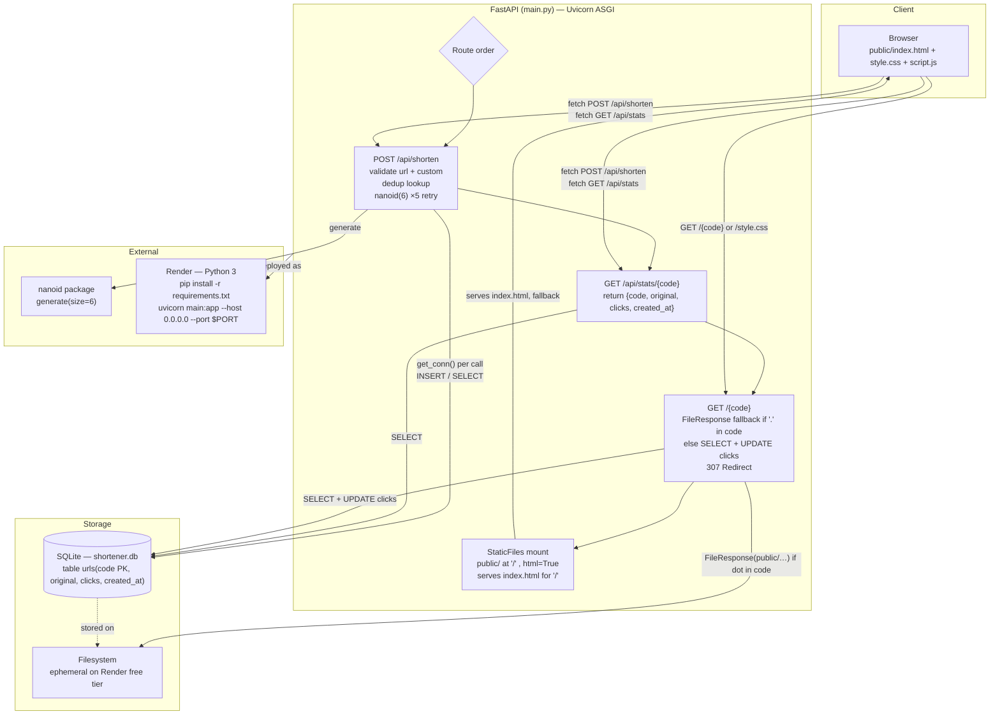

# lnkshrnk — URL Shortener

> Paste a long link, get a short code. Custom aliases, dedup, click counting. FastAPI + SQLite + nanoid, single-file backend.

Live: `https://<your-render-service>.onrender.com` · Local: `http://127.0.0.1:8000`

---

## Overview

`lnkshrnk` is a production-ready URL shortener built for Render’s free tier. No framework on the frontend — plain HTML/CSS/vanilla JS served as static files via FastAPI. No ORM — raw `sqlite3` with a fresh connection per request for thread safety under Uvicorn. Codes are generated with the Python `nanoid` package (`nanoid(size=6)`, alphabet `A-Za-z0-9_-`) with a 5-attempt collision retry.

Single job: **shorten a URL fast, with an optional human-readable code, and redirect reliably.**

---

## High-Level Architecture



### Request flows

**1. Shorten** `POST /api/shorten {url, custom?}`

```
client fetch → FastAPI validates http(s)://, custom regex ^[A-Za-z0-9_-]{3,20}$, reserved check (api/admin/static/favicon.ico)
            → if custom is None: SELECT code FROM urls WHERE original = ?  (dedup, returns existing short)
            → if custom: INSERT (code,original) → 409 if IntegrityError
            → else: loop 5× nanoid(6) → INSERT → 500 if all collide
            → return {short: "https://host/code"}
            → error mapping: 400 bad input, 409 conflict, 500 db error (no stack leak)
```

**2. Redirect** `GET /{code}`

```
GET /Ab3x9 → if "." in code: Path("public"/code).is_file() ? FileResponse : 404
           → else SELECT original FROM urls WHERE code=?
           → 404 if missing
           → UPDATE urls SET clicks = clicks+1 WHERE code=?  (best-effort, non-fatal)
           → 307 RedirectResponse to original
```

> Route ordering is intentional: API routes → redirect (`/{code}` with FileResponse dot-fallback) → `app.mount("/", StaticFiles(directory="public", html=True))`. This satisfies the spec (“mount AFTER redirect”) while avoiding shadowing of `/style.css`/`/script.js`.

**3. Stats** `GET /api/stats/{code}` → `SELECT code, original, clicks, created_at` → 404 if missing.

**Thread safety:** `get_conn()` (`main.py:23`) opens a fresh `sqlite3` connection per call (`row_factory=Row`), closed in `finally`. Table init runs on import and on `startup` event (`main.py:53`).

---

## Tech Stack

| Layer | Choice | Why |
|---|---|---|
| Backend | Python + FastAPI (`main.py:50`) | Single app instance, async-ready, Pydantic validation |
| Server | Uvicorn | ASGI, Render-compatible (`$PORT`) |
| DB | SQLite via `sqlite3` (`main.py:23`) | Zero deps, ephemeral is acceptable for free tier |
| IDs | `nanoid` PyPI (`nanoid_generate(size=6)`, `main.py:132`) | Spec-mandated alphabet, not `secrets` |
| Frontend | HTML/CSS/vanilla JS (`public/`) | No build step, served via `StaticFiles` |
| Type | Syne 800 / Inter / JetBrains Mono | Display / body / code |

---

## Project Structure

```
url-shortener/
├── main.py            # FastAPI app, DB helpers, 3 routes + static mount
├── requirements.txt   # fastapi, uvicorn, nanoid, pydantic
├── .gitignore         # __pycache__/, *.pyc, shortener.db, .env, venv/
├── public/
│   ├── index.html     # form (url-input, custom-input, submit), ticket result, copy
│   ├── style.css      # tokens, dotted grid, hard-shadow card, perforated ticket stub
│   └── script.js      # fetch /api/shorten, error handling, clipboard fallback
└── shortener.db       # auto-created at runtime, gitignored
```

### Database schema (`main.py:31`)

```sql
CREATE TABLE IF NOT EXISTS urls (
  code       TEXT PRIMARY KEY,
  original   TEXT NOT NULL,
  clicks     INTEGER DEFAULT 0,
  created_at TEXT DEFAULT CURRENT_TIMESTAMP
);
```

---

## API

### `POST /api/shorten`
Body `ShortenRequest` (`main.py:66`): `{ url: str, custom?: str }`

- Validates `url` starts with `http://` or `https://` → 400
- Validates `custom` matches `^[A-Za-z0-9_-]{3,20}$` and not in `api,admin,static,favicon.ico` (case-insensitive) → 400
- Dedup by `original` lookup → returns existing `short` if no custom
- Custom taken → 409
- Auto code: `nanoid(size=6)` loop 5, catch `IntegrityError` → 500 on exhaustion

Response `200`: `{ "short": "https://<host>/<code>" }`

```bash
curl -X POST http://127.0.0.1:8000/api/shorten \
  -H "Content-Type: application/json" \
  -d '{"url":"https://example.com/very/long","custom":"my-code"}'
```

### `GET /{code}`
- File fallback if `code` contains `.` → `FileResponse(public/…)` else 404
- Else lookup, increment `clicks`, `307` to `original`, else 404

### `GET /api/stats/{code}`
Returns `{ code, original, clicks, created_at }` or 404.

All DB ops wrapped in `try/except` → `HTTPException` with 400/404/409/500, no raw traces (`main.py:104`).

---

## Frontend

- **Hero:** eyebrow `compression utility` + lead copy, no template hero stats.
- **Card:** `2px` ink border + `6px` hard shadow, dotted hint `ORIGINAL ···· SHORT`.
- **Inputs:** `input-wrap` with prefix `↳` / `/`, `JetBrains Mono` for codes, `field-help` for constraints.
- **Button:** signal `#FF3B1F` with hard shadow, `→` shift on hover.
- **Signature — ticket stub** (`public/style.css:299`): left `#FF3B1F` perforated spine + radial-gradient dots, `ticketIn` animation, mono `#short-link` + ink `Copy` button.
- **Meta grid + footer** for dedup/clicks/length hints.
- JS (`public/script.js`): `fetch` POST, handles `400/409` via `detail`, `showResult` re-triggers animation, clipboard via `navigator.clipboard` with `execCommand` fallback, live error clear on input.

---

## Getting Started (local, venv only — no global pip)

```bash
python3 -m venv venv
venv/bin/pip install -r requirements.txt
venv/bin/uvicorn main:app --reload --host 127.0.0.1 --port 8000
# open http://127.0.0.1:8000
```

With activation:

```bash
source venv/bin/activate
pip install -r requirements.txt
uvicorn main:app --reload
```

`shortener.db` is created on import/startup; delete it to reset.

Tests (via `TestClient`, requires `httpx` in venv):

```bash
venv/bin/pip install httpx
venv/bin/python -c "from fastapi.testclient import TestClient; ..."
```

---

## Deployment — Render (free tier)

- Runtime: `Python 3`
- Build: `pip install -r requirements.txt`
- Start: `uvicorn main:app --host 0.0.0.0 --port $PORT` (`main.py:232`)
- Caveats (also in `main.py:234`): filesystem ephemeral → SQLite resets on redeploy; service sleeps after ~15 min idle, first request ~30–50s cold start. Persist with Postgres/Redis when needed.

Zero changes needed from repo to Render.

---

## Error Handling

| Case | Status | Message |
|---|---|---|
| `url` without `http(s)://` | 400 | `URL must start with http:// or https://` |
| `custom` bad pattern | 400 | `Custom code must be 3-20 characters…` |
| `custom` reserved | 400 | `'{code}' is a reserved word…` |
| `custom` taken | 409 | `Custom code already taken` |
| `code` not found (redirect/stats) | 404 | `Short code not found` |
| Static file miss (`code` with `.`) | 404 | `Not Found` |
| DB failure / nanoid exhaustion | 500 | `Database error` / `Failed to generate unique code…` |

---

## License

MIT — see `LICENSE`.
